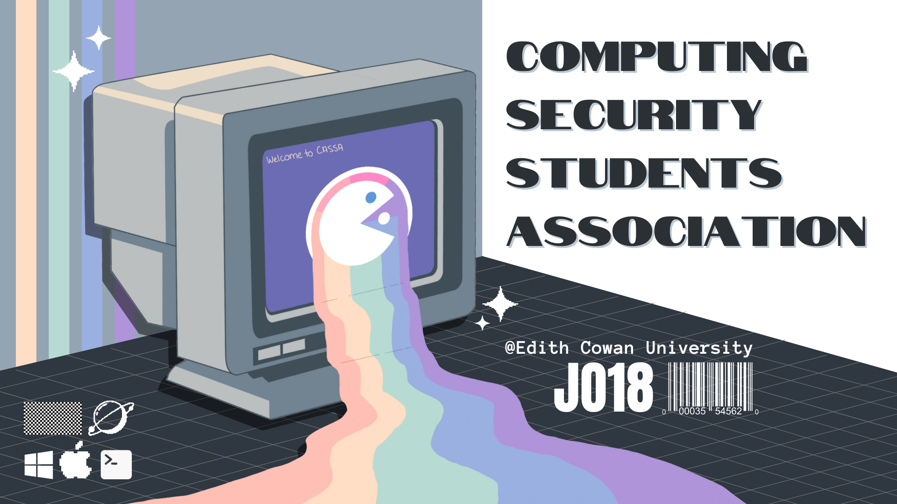

## Who are we?

The Computing and Security Student Association (CASSA) is an organised ECU student club of people who share an intrest in computer science, cyber security, and related fields.

## What do we do?

The purpose of CASSA is to promote knowledge and understanding of computing and security in the ECU university community, through the organisation of events, workshops, and other activities that will foster learning and collaboration amount members.

We strive to forge connections between you and teh future leaders and peers within your industry as well as the current industry leaders through our tailor made events.

## Where are we?

CASSA is made up of both online and on-campus students, recent graduates, and staff at Edith Cowan University. During the university semester, you'll typically find one of our members at the CASSA help desk on [Level 2, Building 18, ECU Joondalup Campus](https://maps.app.goo.gl/D6ZhQREXi12gMt468).

## Constitution

CASSA is a not-for-profit organisation and the following document outlines the fundamental principles, rules, and governance structure of the association.

The document also covers membership eligibility, rights, and responsibilities, as well as the roles of the executive and general committees.

We invite you to review the constituion, follow its rules and engage activley in CASSA activities. Let's create a supportive and thriving community together!

