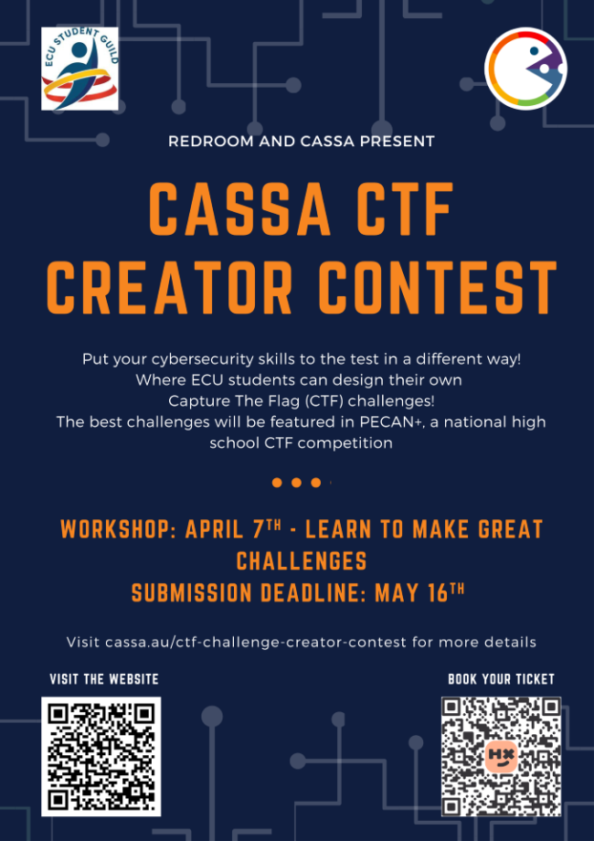

## Design challenges for PECAN+!
Do you want to put your cybersecurity skills to the test in a different way? RedRoom and CASSA are hosting the CTF Creator Contest, where ECU students can design their own CTF challenges! The best challenges will be featured in PECAN+, a national high school CTF competition.

**You only need a ticket if you plan on attending the workshop**

## Key details
- 🏠 Workshop Location: ECU Joondalup building 18 room 207
- 🗓️ Date: Monday the 7th of April
- ⏰ Time: 2pm - 4pm
- 🎫 How to signup: Signup using this link https://events.humanitix.com/cassa-ctf-creator-competition
- ⌛ Submission Deadline: The 16th of May 11:59pm

## Prizes
- 🏆 First Prize: ACS Compendium, ACSC Water Bottle, $50 Steam Gift Card
- 🥈 Second Prize: Microsoft Backpack, ECU Cooler Bag, $35 Steam Gift Card
- 🥉 Third Prize: ASD Flashlight, ECU Puzzle, Sapien Camera Cover, $20 Steam Gift Card
- 🎖️ Most Effort Prize: Sapien Shirt, Sapien Mug, Sapien Camera Cover

You can submit as many challenges as you like, but each participant can only win one prize.

## 🤨 Who can participate? 🤔
- All ECU students are welcome to participate

## 🧩 Challenge submissions 🔥
- Challenges should be suitable for a high school audience
- Challenges must be submitted using an ECU email
- Submission of a challenge implies permission of its use for PECAN+ CTF and related activities
- Any copyrighted material must be properly attributed
- The challenge must use the pecan{flag} format

## Submission Requirements:
- Challenges must be submitted as a ZIP file containing:
    - Challenge Name
    - Challenge Description
    - Challenge Files (if applicable)
    - Author Name
    - Flag
    - Write-up (Solution Guide)
    - Source Code (if applicable)

Submission portal: https://cassa.au/ctf-challenge-creator-contest/