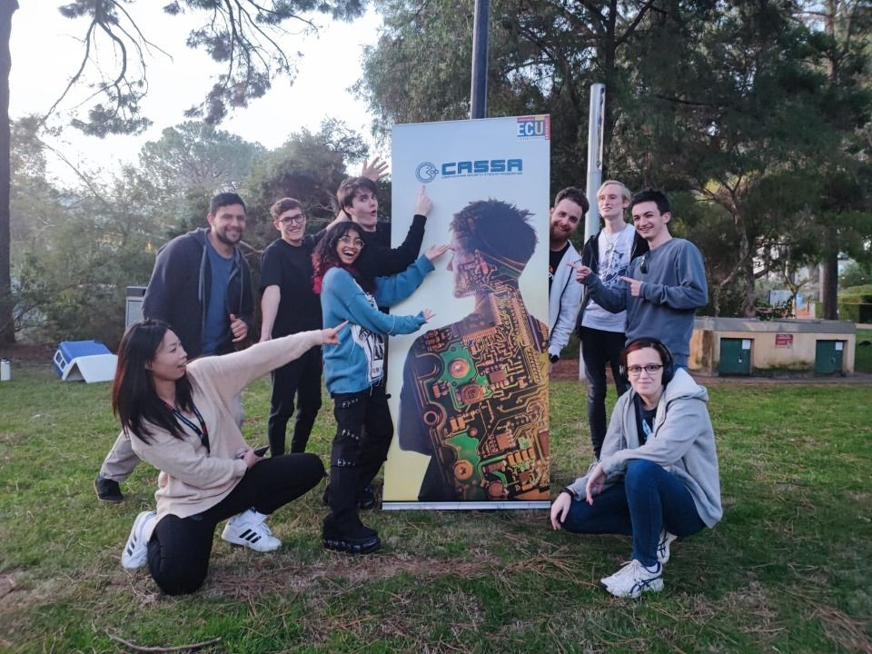
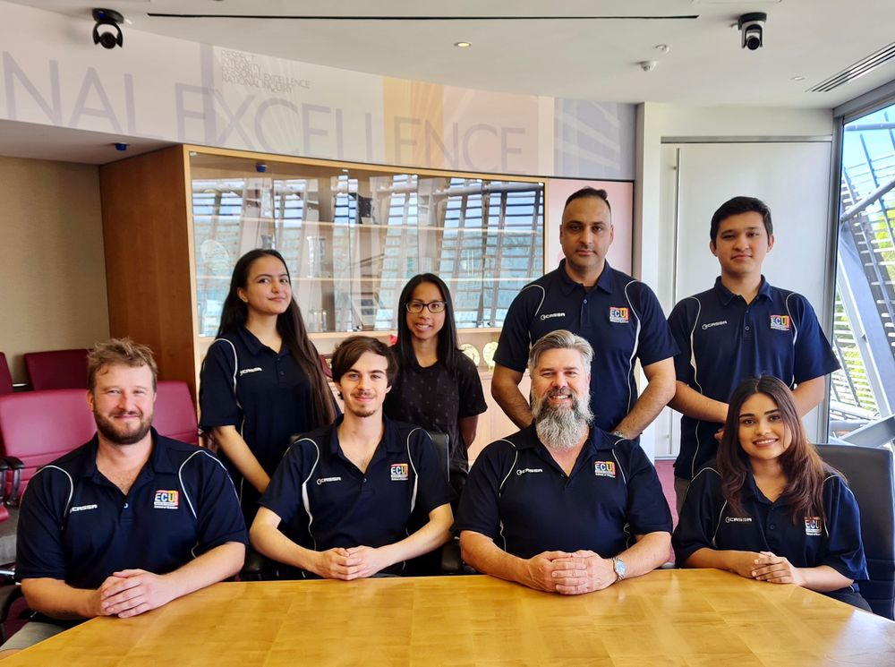
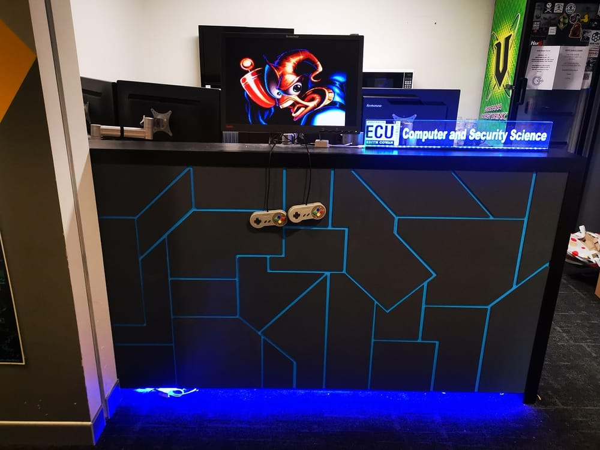
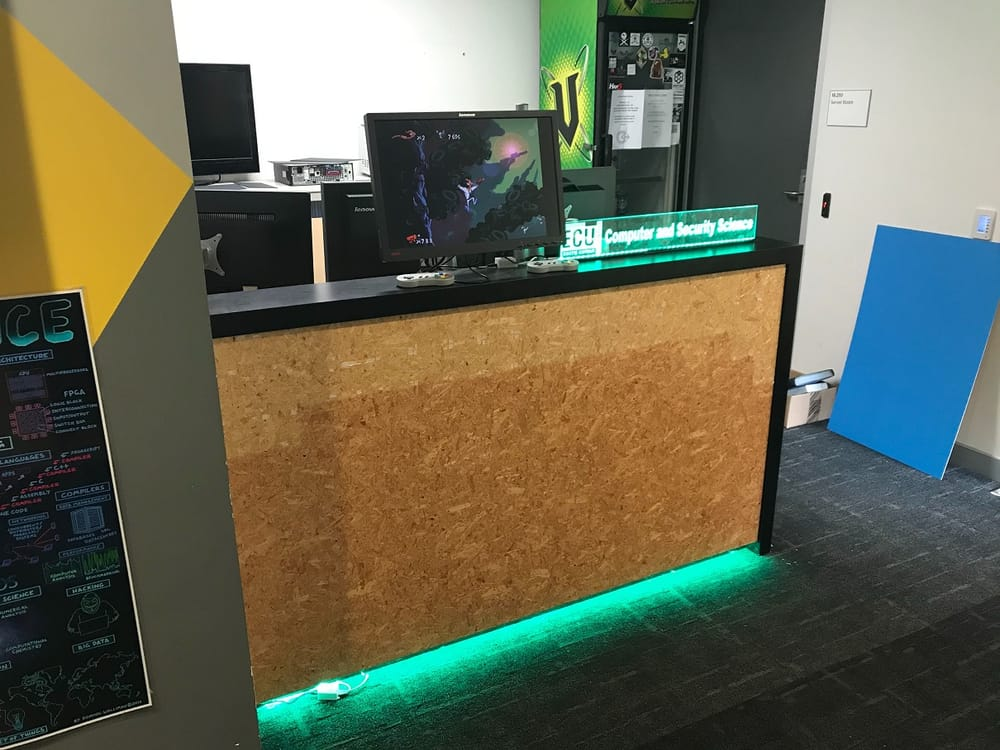

<!-- CSS to make the year headings stand out more-->

> [!NOTE]
> CASSA only has records back to 2005, if you have any records that go further back then this, please let us know at [secretary@cassa.au](mailto:secretary@cassa.au?subject=Timeline%20Records)

## 2026
---

### September 2026
- Nivedha "Missy" Shivakumar steps down from Treasurer, and Monique Cornall replaces her
- The CASSA Website gets rewritten from Ghost CMS to be in two parts, one dynamic site with three.js, and a static site with Hugo using the OINK theme

### August 2026
- CASSA runs L2L hosted by La "Laura" Luo using the docker labs infastructure

### July 2026
- The ECU Guild, CASSA, Red Room, ISSA, Aviators ECU, Rainbow Connect, AFS, Nippon Connect Society, ECU Tabletop, ECU Women In Business, Stitches and Verbal Itches, ECU Space Club, ECU Well Being, and WIEECU, come together and host Inter Club Bowling

### June 2026
- End of Semester Social and AGM are hosted
- The new executive Committee is voted in:
    - President: Dio Lea
    - Vice-President: Nicole Mortin
    - Secretary: David Thomas
    - Treasurer: Nivedha "Missy" Shivakumar
    - Tech Admin: La "Laura" Luo
- CASSA officialy launches its Palworld server

### May 2026
- CASSA along with RedRoom, ISSA, ECU WIBLA, and ECU TableTop run an intraclub trivia night
- the Game Dev Club subcommittee officaly forms and starts running their weekly meet ups

### April 2026
- Learn 2 Linux is held by Benjamin Dodson using the Docker Labs infastructure
- CASSA holds a collab with GG Gamming Lounge to have a games night

### March 2026
- CASSA officialy announces and starts selling Merch in the form of t-shirts and hoodies

### Feburary 2026
- Semester one Guild Fair is held allowing CASSA to meet new people 

## 2025
---

### December 2025
- End of Semester Social is held by CASSA using a Murder Mystery theme created by Erin Hollingsworth and Harper Irwin

### November 2025
- The Sub-committee RedRoom officialy disaffiliates from CASSA and becomes its own affiliated club

### October 2025
- Erwin Thomas is announced new tech admin
- Semester 2 CASSA Industry Connect is held
    - Benjamin Ockwell from McGrath Nicol
    - Olivia Van Der Kroon from ACS + Diversus
    - Emily M G from RAC
    - Mason Crawford from Capgemini
- Learn to Linux workshop held delivered by our esteemed president Lachlan Marshall with special thanks to Laith Striegher and Joshua Finlayson for their tireless work on the new infrastructure
- CASSA wins the Guild 'Best Collaboration of the Year' Award for the intraclub trivia event

### September 2025
- Search for new tech admin begins
- The intraclub trivia event is held in the Birra Bar with the following clubs represented:
    - CASSA
    - ISSA
    - Tabletop ECU
    - Women in Business
- Steve Simpson and Lachlan Gelavis come in to deliver a guest lecture giving students an insight into the local cyber security industry and gives some helpful advice on getting through studies as well as transitioning to industry.

### August 2025
- new committee members added
    - Joshua Finlayson
    - Erin Hollingsworth
    - Harper Irwin
    - Leanne Goh
    - Arnavjeet Mavi
    - Albab Reza
- Riley Grimwood steps away from tech admin role, we thank them for their time and effort.

### July 2025
- CASSA holds a poster creation competition in conjuction with the School of Science with some fantastic prizes.
- Semester two guild fair is held allowing CASSA to meet new people

### June 2025
- AGM is held with new executive team voted in:
    - President: Lachlan Marshall
    - Vice-President: Nicole Mortin
    - Secretary: David Thomas
    - Treasurer: Adelia Widyasari
    - Tech Admin: Riley Grimwood
- End of semester social is held a CASSA inspired game of Jeopardy! presented by ~~Alex Trabek~~ Lachlan Marshall

### May 2025
- Redroom and CASSA concluded the CTF challenge creator competition
    - First prize winner: Wei-Ta Tu for Cookie Factory
    - Second prize winner: Viet Huy Nguyen for Keylogger
    - Third Prize winner: Joshua Finlayson for Tony's Toolyard
    - Highest Effort winner: Monique Cornall for CornMan

### April 2025
- CASSA and redroom CTF creator competition workshop is held and competition is opened for entries.
- Semester one Industry Connect is held with the following speakers:
    - Tyler Nelson from Deloitte
    - Kyle Baker from Bankwest
    - Tara Lie from Department of Water and Environmental Regulation

### March 2025
- Start of semester social 2025 held in Joondalup, giving CASSA members the opportunity to meet and network with fellow members, enjoy some free food (who doesn't love that) highlighted by Lachlan channelling his inner Steve Harvey in a CASSA inspired game of Family Feud.
- New committee members:
    - Kayden-Jai Pearce
    - Bruce Aleandre Damien Legallant
    - Ho Wing Isaac Tang
    - Lamia Raka
    - Ashitha Perincheril Shaji
    - Andy Huynh
    - Laith Striegher
    - Nicole Mortin
- CASSA discord breaks 1000 members

### February 2025
- CASSA attends the ECU guild fair and networked with some new members

### January 2025
- New year, new clean look for the desk

## 2024
---

### December 2024
- Redroom and CASSA hold shared workshops teaching students computer science related skills.
- We get our new Fridge!!!!

### November 2024
- End of Semester social where our members had the opportunity to meet and greet with fellow members and get involved with the coveted CASSA quiz
- Redroom CTF and ECU esports officially become subsidiaries of CASSA
- New subcomittee roles created for RedRoom and Esports
    - Redroom lead: Tyler Scwehr
    - Operations lead: Monique Cornall
    - Master of CTFs: Jeremy Karagania
    - Industry liaison: Lindsay Coudert
    - Member integration: Keelan Panizza
    - System overseer: Riley Grimwood

### October 2024
- A general meeting is held to elect a new President and Vice-President, with Lachlan Marshall filling the role of President and Bec Condon filling the role of Vice-President.

### September 2024
- Devansh Trivedi steps down from the role of President.
- Michael Bodnar is elected as the executive Treasurer.
- New general committee members:
    - Riley Grimwood
    - Shannon Castine
    - Disha Sharma
    - David Thomas
    - Austin George.

### August 2024
- Max Burke-Rowe steps down from the role of Vice-President due to personal reasons.

### July 2024
- The Annual General Meeting is held, electing a new executive body:
    - President: Devansh Trivedi
    - Vice-President: Max Burke-Rowe
    - Secretary: Ming Leong
    - Tech Admin: Jarod Roff
- CASSA attends the ECU Student Guild Clubs Carnival.

### June 2024
- CASSA launches the Creators Contest for PECAN+ CTF for members to have fun creating CTF challenges, win prizes, and contribute to PECAN+ CTF.

### May 2024
- CASSA secures sponsorship from Canva.
- CASSA's third Industry Connect event is ran with great success. Thank you to the panelists:
    - Sam Reid
    - Andra Cimpean
    - Andrew McMaster
    - Sheida Sabeti
    - Samuel Blizard
    - Dhruv Sehgal.
- Tyler Schwehr joins the CASSA General Committee as a RedRoom Subcommittee member.

### April 2024
- ComSSA and CASSA collaborated to run the Amazing Tech Race 2024 event.

### March 2024
- CASSA secures sponsorships from Atlassian and McGrathNicol.
- Fidi and Adelia worked hard on launching CASSA's presence on Instagram and TikTok. Very successful!

### February 2024
- General Committee New Members:
    - James O'Grady (System Administrator)
    - Gaston Chak-Kwok Cheung (System Administrator)
    - Jason Keo (Marketing Coordinator)
    - Gracee Wilson (Marketing Coordinator)
    - Firdaus Hairul (Fidi) Annuar (Marketing Coordinator)
    - Adelia Widyasari (Marketing Coordinator)
- General Committee Role Changes:
    - Jayden MG switches from System Administrator to Event Coordinator.
    - Abi, Aili, and Shannon did not choose to renew their presence in the General Committee.

### January 2024
- Club Secretary Katya transfers to UWA, and the Committee internally elected Winiata Lambert (previous Vice-President) as the new Club Secretary for the remainder of the term.
- RedRoom joins forces with CASSA. The weekly event on Wednesday evenings becomes part of CASSA, which we support with manpower and resources, in return providing further opportunities for our members. A special General Committee role is created specifically for committee members to run RedRoom.
- Joel O'Brien joins the General Committee as a RedRoom Subcommittee member.

## 2023
---

### November 2023
- New General Committee members:
    - Aayush Sahni (Marketing Coordinator)
    - Jayden MG (System Administrator)

### September 2023
- An effort to completely rewrite the constitution was directed by Jarod Roff, voted in unanimously in a general meeting. The constitution rewrite was a large effort and we greatly thank Jarod for his contribution to the club!

### August 2023
- The CASSA Timeline is created.
- A new General Committee is elected on the day of the Start of Semester Social:
    - Jarod Roff (sysadmin / web-dev)
    - Sam Reilly (sysadmin)
    - Nathan Harper (community / events) - did not complete term
    - Bhargav Parthasarathy (syadmin / web-dev)
    - Kai McWilliam (sysadmin) - did not complete term
    - Erwin Thomas (marketing / sysadmin)
    - Wini Lambert (community / events)
    - Abi Ketheeswaran (community / marketing)
    - Shannon Castine (community / events)
    - Mitchell Bates (sysadmin)
    - Ailu Lu (marketing)
    - Leanne Goh (marketing / community / events)
    - Michael Bodnar (stoic doorman)
    - Bec Condon (community)

### July 2023
- CASSA's domain changes from https://cassa.org.au to https://cassa.au due to AUDA policy changes.
- The Committee successfully revive the CASSA website by upgrading the VPS and transitioning the website from WordPress to the Ghost.org CMS. Gone are the regular 'Database error' pages from MongoDB running out of RAM! ;)
- We were unable to migrate most of the WordPress blog posts over, though they are currently preserved on archive.org. Please use the WaybackMachine to see older blog posts.

### June 2023
- A new Executive Committee is elected in the Annual General Meeting:
    - Lachlan Adamson (as President)
    - Alex Hill (as Vice President)
    - Katya Grabovskaya (as Secretary)
    - Sean Macmillan (as Treasurer)
    - Miela Marshall (as Technical Administrator)

### May 2023
- CASSA collaborates with ComSSA on running the Amazing Tech Race event.

### March 2023
- The Executive Committee create a sub-committee, the General Committee, to aid the Executive Committee in fulfilling its goals.

## 2022
---

### June 2022
- A new Executive Committee is elected in the Annual General Meeting:
    - Soumita Kale (as President)
    - Winiata Lambert (as Vice President)
    - Shannon Castine (as Secretary)
    - Kayle Baker (as Treasurer)
    - Miela Marshall (as Technical Administrator)
    - Alexander Hill (as Social Coordinator)
    - Aili Lu (as Event Coordinator)
    - Lachlan Adamson (as Event Coordinator)

## 2021
---

### June 2021
- A new Executive Committee is elected in the Annual General Meeting:
    - Poojan Sharma (as President)
    - Sam Blizard (as Vice President)
    - Darren McGrath (as Secretary)
    - Blair Johnston (as Treasurer)
    - Sheida Sabeti (as Events Coordinator)
    - Callum Thomas (as Events Coordinator)
    - Yona Millner (as Social Committee)
    - Jakub Nowak (as Tech Admin)

## 2020
---

### June 2020
- A new Executive Committee is elected in the Annual General Meeting:
    - Niall Navin (as President)
    - Lachlan Barker (as Vice President)
    - Morium Mostafa Momo (as Secretary)
    - Grant Hunter (as Treasurer)
    - Poojan Sharma (as Events Coordinator)
    - Cherie Barringhaus (as Events Coordinator)
    - Samiollah Ranjbar (as Social Committee)
    - Ujjwal Miglani (as Tech Admin)

### March 2020
The Committee designed and built a new front aesthetic for the CASSA Helpdesk. Huge aesthetic upgrade 😄 See [here](https://web.archive.org/web/20220301092423/https://cassa.org.au/cassa-helpdesk-renovation/) for the original blog post on archive.org (old blog).

New Helpdesk

Old Helpdesk

## 2019
---

### June 2019
- A new Executive Committee is elected in the Annual General Meeting:
    - Matt Giovinazzo – President
    - Sriharsha Devalpally – Vice President
    - Georgia Maher – Secretary
    - Jordan Davies – Treasurer
    - Kenneth Tan – Events Coordinator
    - Niall Navin – Events Coordinator
    - Janae Weiss – Social Committee
    - Jack Nelson – Tech Admin

## 2018
---

### Semester 2
- A new Executive Committee meeting is elected:
    - Alexander Macpherson – President
    - Dan Buzzard – Vice President
    - Nick Pleass – Treasurer
    - Warren Cabral – Secretary
    - Gary Peel – Tech Admin

### Semester 1
- A new Executive Committee is elected:
    - Jean-luc McGrath – President
    - Dan Buzzard – Vice President
    - Ginger Ackers – Treasurer
    - Alex Macpherson – Secretary
    - Gareth Clarson – Tech Admin
    - Sam West – Events Co-ordinator
    - Ashley Woodiss-Field – Presidential Advisor
- Technical Sub-Committee Team:
    - Gareth Clarson – Tech Committee Chair
    - Damion Brown – Tech Team Member
    - Dan Buzzard – Tech Team Member
    - Taylor Spinks – Tech Team Member
    - William Termini – Tech Team Member
    - David Maxwell – Tech Team Member
    - JamesTK – UniIRC Admin
    - Kash Holmes – Tech Support

## 2017
---

### Semester 2
- A new Executive Committee is elected:
    - Jean-luc McGrath – President
    - Dan Buzzard – Vice President
    - Ginger Ackers – Treasurer
    - Alex Macpherson – Secretary
    - Damion Brown – Acting Tech Admin
    - Tyson Weatherley – Social Chair
    - Ashley Woodiss-Field – Presidential Advisor

- Technical Sub-Committee Team:
    - Damion Brown – Tech Committee Chair
    - Gareth Clarson – Tech Team Member
    - David Maxwell – Tech Team Member
    - Taylor Spinks – Tech Team Member
    - William Termini – Tech Team Member
    - Dan Buzzard – Tech Team Member
    - JamesTK – UniIRC Admin
    - Kash Holmes – Tech Support

- Social Sub-Committee:
    - Jean-luc McGrath – Social Committee Chair
    - Caiden Burkett – Promotions & Events
    - Rayhab Mokoto – Promotions & Events
    - Marko Vasev – Promotions & Events
    - Alex Green – Promotions & Events
    - Andrea Zonnekus – Events
    - Tyson Weatherley – Master of Board Games

### Semester 1
- A new Executive Committee is elected:
    - Gareth Clarson – President
    - Dan Buzzard – Vice President
    - Taylor Spinks – Treasurer
    - Elliot J – Secretary
    - Damion Brown – Tech Admin
    - Jean-luc McGrath – Social Chair
    - David Maxwell – Presidential Advisor

- Technical Sub-Committee Team:
    - Damion Brown – Tech Committee Chair
    - Gareth Clarson – Tech Team Member
    - David Maxwell – Tech Team Member
    - Taylor Spinks – Tech Team Member
    - William Termini – Tech Team Member
    - Dan Buzzard – Tech Team Member
    - JamesTK – UniIRC Admin
    - Kash Holmes – Tech Support

- Social Sub-Committee:
    - Jean-luc McGrath – Social Committee Chair
    - Caiden Burkett – Promotions & Events
    - Rayhab Mokoto – Promotions & Events
    - Marko Vasev – Promotions & Events
    - Alex Green – Promotions & Events
    - Andrea Zonnekus – Events
    - Tyson Weatherley – Master of Board Games

## 2016
---

### Semester 2
- A new Executive Committee is elected:
    - David Maxwell – President
    - Adam Nygate – Vice President
    - Dan Buzzard – Treasurer
    - Elliot J – Secretary
    - Gareth Clarson – Tech Admin
    - Mathew Aristei – Social Chair
    - Ashley Woodis-field – Presidential Advisor
    - Sam Reid – Representative Chair

- Tech Team:
    - Gareth Clarson – Tech Admin
    - Dan Buzzard – Webmaster and Newsletter
    - David Maxwell – Tech Support
    - Tobias Needs – Tech Support
    - William Termini – Tech Team Member
    - Damion Brown – Tech Team Member
    - Taylor Spinks – Tech Team Member
    - Caine Bubb – Tech Team Member
    - Justin Homsi – Tech Team Member
    - Mathew Burr – Tech Team Member
    - Matthew Offrings – Tech Team Member
    - Roger Harrison – Tech Team Member
    - Scott Trippins – Tech Team Member

- Social Team:
    - Mathew Aristei – Social Chair
    - Caiden Burkett – Promotions & Events
    - Rayhab Mokoto – Promotions & Events
    - Marko Vasev – Promotions & Events
    - Alex Green – Promotions & Events

### Semester 1
- A new Executive Committe is elected:
    - David Maxwell – President
    - Mat Aristei – Vice President
    - William Termini – Treasurer
    - Tyson Mcelroy – Secretary
    - Dan Traeger – Asset Manager
    - Alex Green – Social Co-Ordinator
    - Damion Brown – Tech Admin
    - Adam Foster – Web Admin
    - Adam Nygate – Employment Advisor
    - Caiden Burkett – 1st Year Representative
    - Dan – 2nd Year Representative
    - Sam Reid – 3rd Year Representative
    - Ashley Woodis-Field – Post-Grad Representative / Presidential Advisor
    - Luke Mercuri – Ordinary Committee Member
    - Jacob Chapman – Ordinary Committee Member

## 2015
---

### Undated
- A new Executive Committee is elected:
    - President – Ashley Woodiss-Field
    - Vice President – David Maxwell
    - Treasurer – Mathew Aristei
    - Secretary – Alex Green
    - Technical Administator – William Termini
    - Website Administator – Sam Reid
    - JO Events Manager – Evan Roberts
    - ML Events Manager – Rylan Gristwood

## 2014
---

## Undated
- A new Executive Committee is elected:
    - Alexandra Helens – President
    - Ashley Woodiss-Field – Vice-President
    - Damon Baldwin – Secretary
    - Matthew Aristei – Treasurer
    - James Taylor – Web Admin
    - William Termini – Tech Admin
    - Brandon Bastian – Events Coordinator

## 2013
---

### Undated
- A new Executive Committee is elected:
    - Lewis Meier – President
    - Ashley Woodis-Field – Vice-President
    - Sam Reid – Treasurer
    - Brandon Bastian – Secretary
    - Alexandra Helens – Events Coordinator
    - James Taylor – Tech Admin
    - Louis Crossing – Web Admin

## 2012
---

### Undated
- A new Executive Committee is elected:
    - Rob McKnight – President
    - Simon Vin – Vice-President
    - Luke Spartalis – Secretary
    - Joshua Norris – Treasurer
    - Michael Alderman – Tech-Admin
    - Jason Baseley – Webmaster
    - Alexandra Helens – Social Events Coordinator

## 2011
---

### Undated
- A new Executive Committee is elected:
    - President – Stuart Pearson
    - Vice President – Randal Adamson
    - Secretary – Jovin Sveinbjornsson
    - Secretary – Jetha Chan
    - Treasurer – Steph Stidolph
    - Technical Administrator – Rob McKnight
    - Technical Administrator – Simon Vin
    - Social Coordinator – Jason Baseley
    - General Committee Member – Rhys Hunter

## 2010
---

### Undated
- A new Executive Committee is elected:
    - President – Jana Buvari
    - Vice President – Jetha Chan
    - Secretary – Stuart Pearson
    - Treasurer – Steph Stidolph
    - Webmaster – Nick Coucaud
    - Webmaster – Stuart Pearson
    - Staff Rep – Peter Hannay

## 2009
---

### Undated
- A new Executive Committee is elected:
    - President – Gwyn Hannay
    - Vice President – David Cooper
    - Treasurer – Matt Woods
    - Secretary – Lynette Thompson
    - Tech Admin – Glen Thompson
    - Tech Admin – Peter Hannay
    - Webmaster – Glen Thompson
    - Staff Representative – Peter Hannay
    - General Committee – Jetha Chan
    - General Committee – Stuart Pearson
    - General Committee – Greg Baatard

## 2008
---

### Undated
- A new Executive Committee is elected:
    - Daniel Meakins – President
    - Matt Woods – Vice President
    - Dean Bergin – Treasurer & Tech Manager
    - Phil Rosati – Secretary & Tech Manager
    - Nic Cope – Presidents Advisor
    - Greg Baatard – Postgrad Rep
    - Peter Hannay – Staff Rep
    - Martin Masek – Staff Rep
    - Kyle Tedeschi – 3nd Year Students Rep
    - Gwyn Hannay – 1st Year Students Rep

## 2007
---

### Undated
- A new Executive Committee is elected:
    - Nic Cope – President
    - Peter Hannay – Vice President
    - Roslyn Dinkgreve – Treasurer & Events
    - Matt Woods – Secretary of State
    - Graham Vanderplank – Presidents Advisor
    - Phil Rosati – Tech Manager
    - Alexis Guillot – Third Year Rep
    - Marwan Al-Zarouni – Postgrad Rep
    - Martin Masek – Staff Rep
    - Sam Bishop – Commitee Member

## 2006
---

### Undated
- A new Executive Committee is elected:
    - Graham Vanderplank – President
    - Nic Cope – Vice President
    - Roslyn Dinkgreve – Treasurer
    - Peter Hannay – Secretary
    - Joe James – Presidents Advisor
    - Phil Rosati – Tech Manager 1
    - Sam Bishop – Tech Manager 2
    - Jaron Power – First Year Rep
    - Matt Woods – Second Year Rep
    - Garry Trinh – Third Year Rep
    - Marwan Al-Zarouni – Postgrad Rep
    - Martin Masek – Staff Rep

## 2005
---

### Undated
- A new Executive Committee is elected:
    - Joe James – President
    - David Young – Acting Vice President
    - Joshua Pore – Treasurer
    - Georgia Blair – Secretary
    - Graham Vanderplank – Social Events
    - Nic Cope – Web Manager
    - Leo Treasure – First Year Rep
    - Mark Glorie – General Committee
    - Ryan Passmore – General Committee
    - Rowan Sharp – General Committee
    - Marco Fiscato – General Committee
    - Chris Bolan – Staff Rep